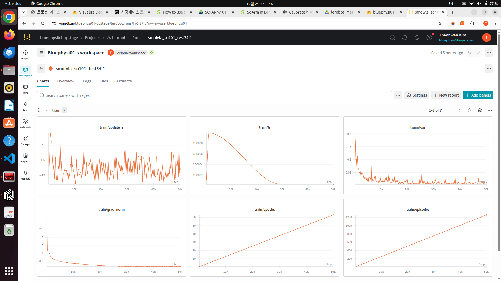
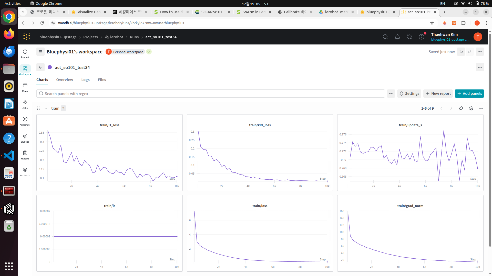
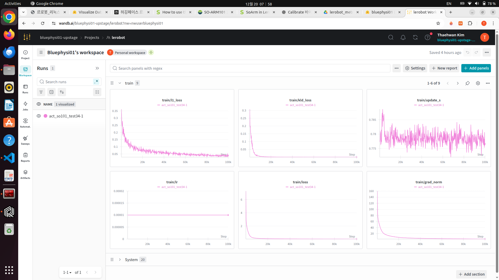
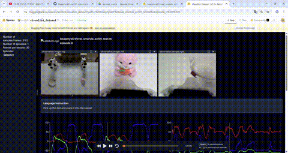

# SO-101 듀얼암(양팔) LeRobot 확장 및 실험 기록

이 폴더는 Hugging Face **LeRobot** 소스코드에 듀얼암(SO-101 양팔) 지원을 추가하고,  
동일한 데이터셋(`so101_test34`)으로 SmolVLA와 ACT 정책을 학습·비교한 결과를 정리한 공간입니다.  
`test34`가 포함된 자산(assets)과 설정 파일은 모두 **같은 데이터셋으로 학습한 모델 변형 실험**입니다.

---

## 핵심 변경 사항 (듀얼암 지원)
- `bi_so101_follower/bi_so101_follower.py`  
  두 개의 `SO101Follower`를 묶어 `left_` / `right_` 프리픽스가 붙은 관측·액션을 생성.
- `bi_so101_leader/bi_so101_leader.py`  
  두 개의 `SO101Leader` 입력을 통합해 양팔 텔레옵을 제공.
- `robots/utils.py`, `teleoperators/utils.py`  
  `bi_so101_follower`, `bi_so101_leader` 타입을 공장 함수에 등록해 CLI/스크립트에서 바로 사용.
- `scripts/lerobot_record.py`  
  위 타입을 임포트하여 데이터 수집·추론 스크립트가 듀얼암을 인식하도록 수정.

---

## 듀얼암 데이터 수집 예시 (so101_test34)
```bash
python -m lerobot.scripts.lerobot_record \
  --robot.type=bi_so101_follower \
  --robot.left_arm_port=/dev/ttyACM1 \
  --robot.right_arm_port=/dev/ttyACM3 \
  --robot.id=bimanual_follower \
  --robot.cameras="{
    top:   {type: opencv, index_or_path: 0, width: 640, height: 480, fps: 30, warmup_s: 3},
    left:  {type: opencv, index_or_path: 6, width: 640, height: 480, fps: 30, warmup_s: 3},
    right: {type: opencv, index_or_path: 4, width: 640, height: 480, fps: 30, warmup_s: 3}
  }" \
  --teleop.type=bi_so101_leader \
  --teleop.left_arm_port=/dev/ttyACM0 \
  --teleop.right_arm_port=/dev/ttyACM2 \
  --teleop.id=bimanual_leader \
  --dataset.repo_id=${HF_USER}/so101_test34 \
  --dataset.fps=30 \
  --dataset.num_episodes=30 \
  --dataset.single_task="Pick up the doll and place it into the basket" \
  --display_data=true \
  --play_sounds=true
```

---

## 학습 명령 예시 (데이터셋 `so101_test34`)

- **SmolVLA (기본 10k 스텝)**
```bash
python -m lerobot.scripts.lerobot_train \
  --dataset.repo_id=bluephysi01/so101_test34 \
  --policy.path=lerobot/smolvla_base \
  --policy.device=cuda \
  --policy.chunk_size=30 \
  --policy.n_action_steps=30 \
  --policy.n_obs_steps=60 \
  --batch_size=16 \
  --num_workers=8 \
  --steps=10000 \
  --policy.push_to_hub=true \
  --policy.repo_id=bluephysi01/smolvla_so101_test34
```

- **SmolVLA (확장 50k 스텝, `smolvla_so101_test34-1`)**
```bash
... 동일 옵션 ...
--steps=50000 \
--policy.repo_id=bluephysi01/smolvla_so101_test34-1
```

- **ACT (10k 스텝)**
```bash
python -m lerobot.scripts.lerobot_train \
  --dataset.repo_id=bluephysi01/so101_test34 \
  --policy.type=act \
  --policy.device=cuda \
  --policy.chunk_size=30 \
  --policy.n_action_steps=30 \
  --batch_size=8 \
  --num_workers=8 \
  --steps=10000 \
  --policy.push_to_hub=true \
  --policy.repo_id=bluephysi01/act_so101_test34
```

- **ACT (장시간 100k 스텝, `act_so101_test34-1`)**
```bash
... 동일 옵션 ...
--steps=100000 \
--policy.repo_id=bluephysi01/act_so101_test34-1
```

---

## 실험 요약 (모두 `so101_test34` 데이터셋)
| 런 이름 | 정책 | 스텝 | 배치 | 시퀀스 설정 | 허브 업로드 |
|--------|------|------|------|-------------|-------------|
| smolvla_so101_test34 | SmolVLA | 10k | 16 | chunk=30, n_action=30, n_obs=60 | `bluephysi01/smolvla_so101_test34` |
| smolvla_so101_test34-1 | SmolVLA | 50k | 16 | chunk=30, n_action=30, n_obs=60 | `bluephysi01/smolvla_so101_test34-1` |
| act_so101_test34 | ACT | 10k | 8 | chunk=30, n_action=30, n_obs=1 | `bluephysi01/act_so101_test34` |
| act_so101_test34-1 | ACT | 100k | 8 | chunk=30, n_action=30, n_obs=1 | `bluephysi01/act_so101_test34-1` |

- 입력 특징: 3개 카메라(`camera1~3`, 256×256) + 상태 6차원.
- 모든 실험은 동일 데이터셋을 사용하고 정책 종류나 스텝 수만 변경했습니다.

---

## 학습 로그/결과 이미지 (assets)
- SmolVLA 50k: 
- ACT 10k: 
- ACT 100k: 

각 이미지에는 W&B가 기록한 학습 곡선 및 주요 메트릭이 포함되어 있습니다.

---

## 데모 비디오
